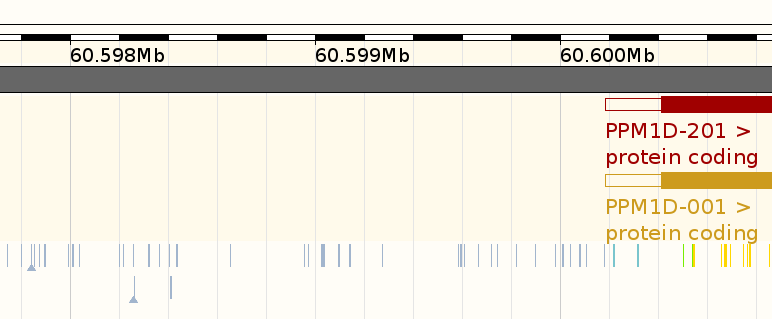

# What are eQTL?

# Detecting eQTL
## How do we know whether a locus is associated with the expression of a gene? {data-transition="none"}

* **Any given locus contains multiple SNPs.**
* Can determine genotypes for these SNPs in a (large) number of individuals.
* Measure gene expression for genes of interest.
* Assess the evidence that expression varies with genotype.

 

## How do we know whether a locus is associated with the expression of a gene? {data-transition="none"}

 sample	   snp_1   snp_2   snp_3   ...
--------   -----   -----   -----  -----
sample 1    AA      AA      AB     ...
sample 2    AB      AB      AA     ...
sample 3    AB      BB      AB     ...
...        ...     ...      ...    ...

* Any given locus contains multiple SNPs.
* **Can determine genotypes for these SNPs in a (large) number of individuals.**
* Measure gene expression for genes of interest.
* Assess the evidence that expression varies with genotype.

 

## How do we know whether a locus is associated with the expression of a gene? {data-transition="none"}

 sample	   gene_1   gene_2   gene_3   ...
--------   ------  ------    ------  -----
sample 1    7.3     12.8      6.5     ...
sample 2    10.9    9.6       8.8     ...
sample 3    9.5     10.7      15.1    ...
...         ...     ...       ...     ...

* Any given locus contains multiple SNPs.
* Can determine genotypes for these SNPs in a (large) number of individuals.
* **Measure gene expression for genes of interest.**
* Assess the evidence that expression varies with genotype.

 

## How do we know whether a locus is associated with the expression of a gene? {data-transition="none"}

* Any given locus contains multiple SNPs.
* Can determine genotypes for these SNPs in a (large) number of individuals.
* Measure gene expression for genes of interest.
* **Assess the evidence that expression varies with genotype.**

 

## Linear additive model

